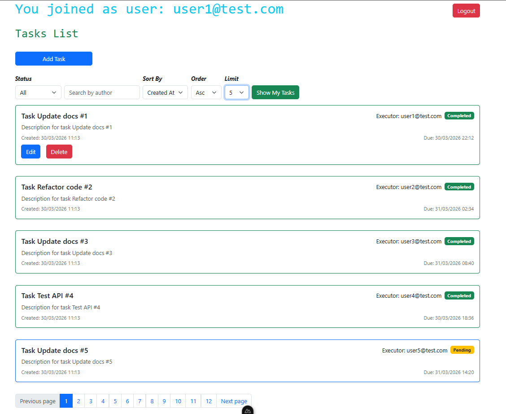

# Task Manager App

## Описание проекта
Приложение для управления задачами с разделением ролей (admin, user).  
- **Backend**: Node.js + Express + SQLite  
- **Frontend**: Nuxt 3 + Tailwind CSS  
- **База данных**: SQLite, автоматический сидинг пользователей и задач  

---

## Структура репозитория

├── server/ # Backend (API + DB)
├── client/ # Frontend (Nuxt 3)
├── README.md


---

## Требования
- Node.js v20+  
- pnpm v8+  

---

## Установка и запуск

### 1. Клонируем репозиторий
```bash
git clone <REPO_URL>
cd <REPO_NAME>
2. Настройка backend
cd server
npm install
```
---

### 2. Создайте .env файл в папке server:
```bash
PORT=3000
FRONTEND_APP_URL=http://localhost:5173

JWT_SECRET_ACCESS_STRING=your_access_secret
JWT_SECRET_REFRESH_STRING=your_refresh_secret
```
---
### Важно: укажите корректный порт frontend в FRONTEND_APP_URL.

Запуск сервера:

```bash
npm run dev
```

Сервер доступен по http://localhost:3000
При первом запуске автоматически создаются пользователи и 60 задач для теста

### Пример пользователей:

admin@test.com
 / 123456 (роль: admin)
user1@test.com
 / 123456 (роль: user)
user2@test.com
 / 123456 (роль: user)

## 3. Настройка frontend
```bash
cd ../client
pnpm install
```

Создайте .env файл в папке client:

NUXT_PUBLIC_API_BASE_URL=http://localhost:3000/api

⚠️ Важно: NUXT_PUBLIC_API_BASE_URL должен указывать на backend.

## Запуск фронтенда:

```bash
pnpm dev
```

## Приложение доступно по адресу http://localhost:5173
API эндпоинты

### Auth
Метод	URL	Описание
POST	/api/auth/login	Вход пользователя (email + password)
### Users
Метод	URL	Описание
GET	/api/users	Получение списка всех пользователей
GET	/api/users/:id	Получение пользователя по ID
### Tasks
Метод	URL	Описание
GET	/api/tasks	Список всех задач текущего пользователя
GET	/api/tasks/:id	Получение задачи по ID
POST	/api/tasks	Создание новой задачи
PUT	/api/tasks/:id	Обновление задачи
DELETE	/api/tasks/:id	Удаление задачи

Все эндпоинты /tasks и /users защищены JWT токеном, кроме /auth/login.

Скриншоты




Заметки
Для изменения порта сервера, обновите .env в папке server.
Для frontend также нужно указать правильный URL сервера.
DB автоматически создается в server/database.sqlite при первом запуске.